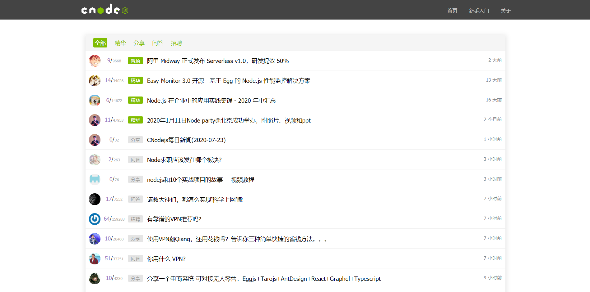

# VueCNode.js

## 说明

> 一个 Vue 的初/中级项目：重构 CnodeJS 社区

[预览](https://angmieee.github.io/vue-cnode/dist/)



## 本地运行

```$xslt
git clone git@github.com:angmieee/vue-cnode.git

cd vue-cnode

npm install // 或者 yarn
 
npm run serve // 或者 yarn serve
```

## 技术栈

[Vue](https://cn.vuejs.org/)

[Axios](https://github.com/axios/axios)

[Vue-Router](https://router.vuejs.org/zh-cn/)

[ElementUI](https://element.eleme.cn/#/zh-CN)

[CnodeJS API](https://cnodejs.org/api)
